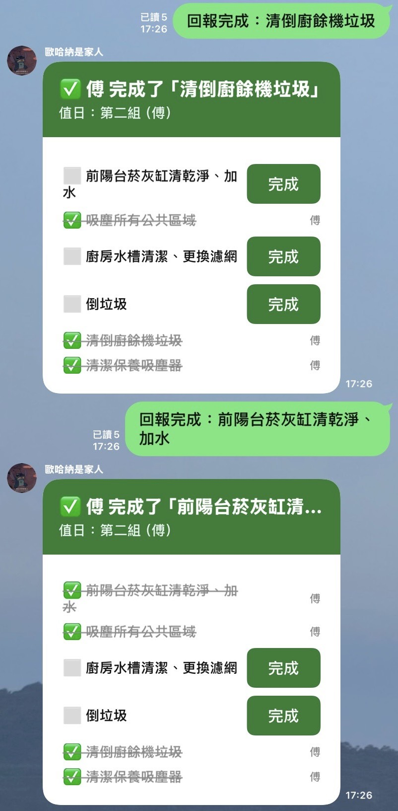
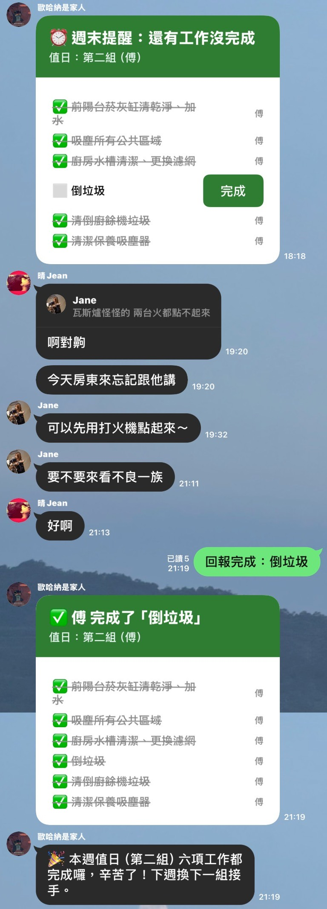

# OhanaMeansFamily

OhanaMeansFamily is a perfect LINE chatbot for your family/roommate group chat, if you don't want to fight over house chores.

OhanaMeansFamily 是給家庭或室友群組使用的完美 LINE 機器人，如果你們不想為了做家事而吵架的話。

## Features / 功能

- Rotates weekly chores among configured household groups.
- 依照設定的室友分組自動輪替每週值日。
- Tracks six chores independently and stops reminders after all chores are complete.
- 六項值日工作可分別回報；全部完成後，該週不再發送提醒。
- Sends a weekly task list on Monday, outstanding-task reminders on Wednesday and Sunday, and an open-to-do reminder on the first day of each month.
- 每週一發送本週任務，週三與週日提醒未完成工作，每月 1 日提醒尚未完成的待辦事項。
- Lets everyone view, add, and complete shared monthly to-do items in the group.
- 任何群組成員都能查看、新增與完成共用的每月待辦事項。

## Usage Examples / 使用範例

The bot sends the weekly chore list and lets group members mark each task complete directly from LINE.

機器人會在 LINE 發送每週值日清單，群組成員可直接標記各項工作為完成。

| Weekly Chore Reminder / 每週值日提醒                                                    | Chore Completion / 工作完成回報                                                 |
| --------------------------------------------------------------------------------------- | ------------------------------------------------------------------------------- |
|  |  |

Scheduling is performed by GitHub Actions, while task and to-do state is stored in Upstash Redis. The bot can therefore run on a service that sleeps while idle, such as Render's free plan.

排程由 GitHub Actions 執行，值日與待辦狀態儲存在 Upstash Redis。因此機器人可部署在閒置時會休眠的服務，例如 Render 免費方案。

<a id="getting-started-開始使用"></a>

## Getting Started / 開始使用

Create and configure a LINE Official Account and Messaging API channel before running the bot locally or deploying it, then follow these in order:
請先建立並設定 LINE 官方帳號與 Messaging API channel，接著依序完成以下步驟：

1. See [LINE setup](LINE_SETUP.md) for the account, channel, token, and group-invitation steps.
   請參閱 [LINE 設定指南](LINE_SETUP.md)，完成帳號、channel、token 與邀請機器人進群組的步驟。
2. Clone this repo and set up local development (see below).
   Clone 這個 repo 並設定本機開發環境（見下方）。
3. See [deployment](DEPLOYMENT.md) for Upstash Redis, Render, and GitHub Actions configuration.
   請參閱 [部署指南](DEPLOYMENT.md)，完成 Upstash Redis、Render 與 GitHub Actions 的設定。

Want to modify the code or report a bug? See [CONTRIBUTING.md](CONTRIBUTING.md).
想修改程式碼或回報問題？請見 [CONTRIBUTING.md](CONTRIBUTING.md)。

## Configuration / 設定

Edit `config.js` to set the household rotation groups, the Monday that starts the rotation, and the chore list. Keep credentials in environment variables rather than in source code.

請編輯 `config.js` 設定室友輪值分組、輪值起算週一與工作項目。憑證請使用環境變數，不要寫入原始碼。

The application requires `LINE_CHANNEL_ACCESS_TOKEN`, `LINE_CHANNEL_SECRET`, `LINE_GROUP_ID`, `CRON_SECRET`, `UPSTASH_REDIS_REST_URL`, and `UPSTASH_REDIS_REST_TOKEN`.

程式需要 `LINE_CHANNEL_ACCESS_TOKEN`、`LINE_CHANNEL_SECRET`、`LINE_GROUP_ID`、`CRON_SECRET`、`UPSTASH_REDIS_REST_URL` 與 `UPSTASH_REDIS_REST_TOKEN`。

## Local Development / 本機開發

Install dependencies with:

請先安裝相依套件：

```bash
npm install
```

Create a local `.env` file with the required environment variables and use a test LINE group ID. Do not use the household production group while developing.

建立包含必要環境變數的本機 `.env` 檔案，並使用測試 LINE 群組 ID。開發時請勿使用正式的室友群組。

Start the server with automatic reloads:

使用自動重新載入模式啟動伺服器：

```bash
npm run dev
```

The server listens on port `3000` by default. To receive LINE webhooks locally, expose it with a temporary public tunnel, then set its `/webhook` URL in the LINE Developers Console.

伺服器預設使用 `3000` 連接埠。本機要接收 LINE webhook 時，請使用暫時的公開 tunnel，並在 LINE Developers Console 設定其 `/webhook` 網址。

Install [cloudflared](https://developers.cloudflare.com/cloudflare-one/connections/connect-networks/downloads/) first and ensure its executable is available on your `PATH`; `npm install` does not install it.

請先安裝 [cloudflared](https://developers.cloudflare.com/cloudflare-one/connections/connect-networks/downloads/)，並確認執行檔可透過 `PATH` 使用；`npm install` 不會安裝它。

```bash
npm run tunnel
```

After testing, set the LINE webhook URL back to the deployed Render URL.

測試完成後，請將 LINE webhook URL 改回已部署的 Render 網址。

## Tests and Manual Checks / 測試與手動檢查

Test the rotation calculation without a network connection:

在不使用網路的情況下測試輪值計算：

```bash
npm run test:rotation
```

Test the Upstash Redis connection with the environment variables in `.env`:

使用 `.env` 內的環境變數測試 Upstash Redis 連線：

```bash
npm run test:db
```

With the local server running, manually invoke the reminder endpoints. These commands send messages to the configured group, so use a test group.

本機伺服器啟動後，可手動呼叫提醒端點。這些指令會傳送訊息到設定的群組，請使用測試群組。

```bash
npm run cron:weekly-kickoff
npm run cron:midweek
npm run cron:weekend
npm run cron:monthly-todo
```

## Group Commands / 群組指令

| Command                      | Description                                                                                     | 說明                                             |
| ---------------------------- | ----------------------------------------------------------------------------------------------- | ------------------------------------------------ |
| `/狀態`                      | Show this week's chore progress.                                                                | 查看本週值日進度。                               |
| `/todo` or `/待辦`           | Show the monthly to-do list.                                                                    | 查看當月待辦清單。                               |
| `/todo 新增 <text>`          | Add a shared to-do item.                                                                        | 新增共用待辦事項。                               |
| `/todo 完成 <number>`        | Mark a numbered to-do item complete.                                                            | 將指定編號的待辦標記完成。                       |
| `/groupid`                   | Print the current LINE group ID in the server logs.                                             | 在伺服器 log 顯示目前 LINE 群組 ID。             |
| `/turn-check` or `/輪值檢查` | Compare the deployed rotation configuration with this week's stored group.                      | 比對目前部署的輪值設定與本週已儲存的組別。       |
| `/turn-sync` or `/輪值同步`  | Sync this week's stored group to the current configuration while preserving completion records. | 將本週已儲存的組別同步為目前設定，保留完成紀錄。 |
